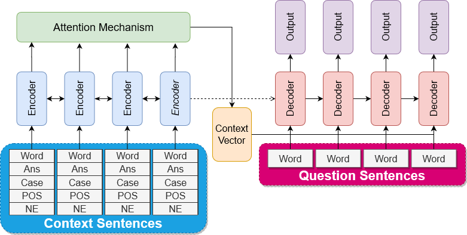
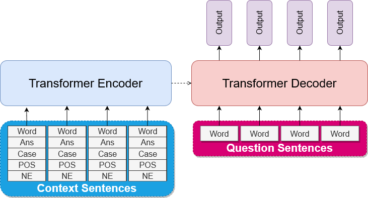

# Sequence-to-Sequence Learning for Indonesian Automatic Question Generator (AQG)

A deep-learning-based Indonesian AQG built using Google-translated SQuAD v2.0 dataset.

This research uses mainly [OpenNMT](https://github.com/OpenNMT/) library for training and inference.

And finally, this README only covers our best models - RNN-based and Transformer-based models using OpenNMT.
(Self-implementation, and GPT2-based model using [huggingface](https://github.com/huggingface/transformers) is not explained here)

## Architecture

### BiRNN (BiLSTM dan BiGRU)


### Transformer  


## Requirements

```shell script
pip install -r requirements.txt
```

*This requirements do not cover huggingface library either.

## Download Datasets

You should download the processed dataset (1.i, and 2.i) if you wish to reproduce the model.
Put the downloaded processed dataset in `data/processed`.

 However I also provide link to the original dataset. Put them in `data/raw` for this original dataset.

1. SQuAD v2.0:
    1. Processed (translated, augmented with linguistic features): [TBD]()
    2. Original SQuAD v2.0: [train set](https://rajpurkar.github.io/SQuAD-explorer/dataset/train-v2.0.json), [dev set](https://rajpurkar.github.io/SQuAD-explorer/dataset/dev-v2.0.json)
2. TyDiQA GoldPassage:
    1. Processed (Indonesian only [this script only runs in Linux-based terminal]):
        ```shell script
        python src/data/download_tydiqa_goldpassage_indonesian.py
        ```
    2. Original TyDiQA GoldPassage [All language](https://storage.googleapis.com/tydiqa/v1.1/tydiqa-goldp-v1.1-train.json)

## Notebooks

All notebooks are stored in `notebook` directory, and was mainly used for **data and method exploration**.
You **can** ignore these notebooks if you seek to reproduce the models. 

## Prepare Data 

This step will convert the downloaded processed dataset into txts containing paragraphs (input), and questions (target).

We use **SQuAD and TyDiQA** dataset, as well as **Uncased and Cased**. 

1. SQuAD v2.0
    1. Cased
        ```shell script
        python src/preprocess/prepare_data.py \
            --dataset_name=squad_id \
            --train_squad_path=data/processed/train-v2.0-translated_fixed_enhanced.json \
            --dev_squad_path=data/processed/train-v2.0-translated_fixed_enhanced.json \
            --train_val_split=0.9 \
            --src_max_len=70 \
            --tgt_max_len=20 \
            --seed 42
        ```
    2. Uncased
        ```shell script
        python src/preprocess/prepare_data.py \
            --dataset_name=squad_id \
            --train_squad_path=data/processed/train-v2.0-translated_fixed_enhanced.json \
            --dev_squad_path=data/processed/dev-v2.0-translated_fixed_enhanced.json \
            --train_val_split=0.9 \
            --src_max_len=70 \
            --tgt_max_len=20 \
            --lower
            --seed 42
        ```
2. TyDiQA GoldPassage (we finally only used the _dev set_)
    1. Cased
        ```shell script
        python src/preprocess/prepare_data.py \
            --dataset_name=tydiqa_id \
            --train_squad_path=data/processed/train-v2.0-translated_fixed_enhanced.json \
            --dev_squad_path=data/processed/train-v2.0-translated_fixed_enhanced.json \
            --train_val_split=0.9 \
            --src_max_len=70 \
            --tgt_max_len=20 \
            --seed 42
        ```
    2. Uncased
        ```shell script
        python src/preprocess/prepare_data.py \
            --dataset_name=tydiqa_id \
            --train_squad_path=data/processed/tydiqa-goldp-v1.1-train-indonesian_prepared_enhanced.json \
            --dev_squad_path=data/processed/tydiqa-goldp-v1.1-dev-indonesian_prepared_enhanced.json \
            --train_val_split=0.9 \
            --src_max_len=70 \
            --tgt_max_len=20 \
            --lower
            --seed 42
        ```

## Training and Evaluation

You can find all models' training and evaluation scripts in `src/onmt/config`.
These scripts are not recommended to be directly executed, instead open it manually with text editor, and copy-paste them.

We had prepared the configuration scripts to be as self-explanatory as possible.

### Our Best Models' Numbers

We keep all model configurations. Some configurations resulting the best models defined in our paper are:

| Model                 | Configuration Name |
|-----------------------|--------------------|
| **BiGRU-3**           |                    |
| Cased                 | gru_45             |
| Cased-Copy            | gru_43             |
| Cased-Copy-Coverage   | gru_33             |
| Uncased               | gru_41             |
| Uncased-Copy          | gru_39             |
| Uncased-Copy-Coverage | gru_37             |
| **BiLSTM-3**          |                    |
| Cased                 | lstm_44            |
| Cased-Copy            | lstm_45            |
| Cased-Copy-Coverage   | lstm_32            |
| Uncased               | gru_40             |
| Uncased-Copy          | gru_38             |
| Uncased-Copy-Coverage | gru_36             |
| **Transformer-3**     |                    |
| Cased                 |  transformer_11    |
| Cased-Copy            |  transformer_12    |
| Uncased               |  transformer_14    |
| Uncased-Copy          |  transformer_13    | 

### Prediction and Evaluation Logs

You can find all logs in:
1. Prediction: `reports/txts/onmt/<configuration_name>*_pred.txt`
2. Evaluation: `reports/txts/onmt/eval_log*.txt`

### Running Free-input Question Generation

Currently these models heavily dependent on third party ([Prosa.ai](https://prosa.ai)) API for POS Tag and NE.

There are some provided scripts to run the free-input generation, but the API is not publicly accessible.  
**You are unable to use free-input to the model.**

If you have access however, you would be able to execute this script:
```shell script
python src/onmt/run_free_generation.py \
    --preprocess_output_path=free_input_001.txt \
    --uncased \
    --pred_output_path=free_input_001_pred.txt \
    --model_path=model/final/gru_037_step_16050.pt \
    --beam_size=2
```
