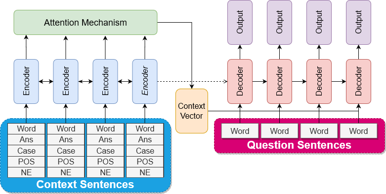
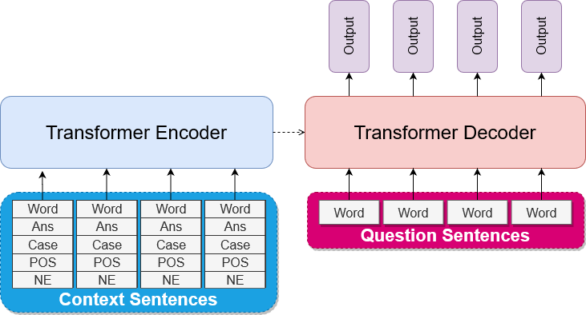

# Sequence-to-Sequence Learning for Indonesian Automatic Question Generator (AQG)

_(*For README in Indonesian, refer to [this one instead](docs/README.md))_

A deep-learning-based Indonesian AQG built using Google-translated SQuAD v2.0 dataset.
Our research paper here:

1. [IEEE](https://ieeexplore.ieee.org/document/9429032)
2. [arXiv](https://arxiv.org/abs/2009.13889)

This research uses mainly [OpenNMT](https://github.com/OpenNMT/) library for training and inference.

And finally, this README only covers our best models - RNN-based and Transformer-based models using OpenNMT.
(Self-implementation, and GPT2-based model using [huggingface](https://github.com/huggingface/transformers) is not explained here)

## Architecture

### BiRNN (BiLSTM dan BiGRU)


### Transformer  


## Requirements

```shell script
pip install -r requirements.txt
```

*These requirements do not cover huggingface library either.

## Download Datasets

You should download the processed dataset (1.i, and 2.i) if you wish to reproduce the model.
Put the downloaded processed dataset in `data/processed`.

 However I also provide link to the original dataset. Put them in `data/raw` for this original dataset.

1. SQuAD v2.0:
    1. Processed (translated, augmented with linguistic features): [processed train & dev set](https://drive.google.com/drive/folders/16AuXmEzxRgenc4JOdA5mhO_I0eCSg6Z7?usp=sharing)
    2. Original SQuAD v2.0: [train set](https://rajpurkar.github.io/SQuAD-explorer/dataset/train-v2.0.json), [dev set](https://rajpurkar.github.io/SQuAD-explorer/dataset/dev-v2.0.json)
2. TyDiQA GoldPassage:
    1. Processed (translated, augmented with linguistic features): [processed train & dev set](https://drive.google.com/drive/folders/16AuXmEzxRgenc4JOdA5mhO_I0eCSg6Z7?usp=sharing) 
    2. Indonesian only [this script only runs in Linux-based terminal]:
        ```shell script
        python src/data/download_tydiqa_goldpassage_indonesian.py
        ```
    3. Original TyDiQA GoldPassage [All language](https://storage.googleapis.com/tydiqa/v1.1/tydiqa-goldp-v1.1-train.json)

## Download Word Embeddings

All models in this research utilize Indonesian part of [Fastext's word vector for 157 languages.](https://fasttext.cc/docs/en/crawl-vectors.html).
This word embedding is converted to GloVe format as OpenNMT only support GloVe-formatted word embedding.

You can download the converted GloVe-formatted Fasttext word embedding [here](https://drive.google.com/file/d/1yD5nFsw8vMjCq90chROyAL0kGzPxFVMY/view).

Then put the word-embedding in `models/word-embedding/ft_to_gl_300_id.vec`.

## Notebooks

All notebooks are stored in `notebook` directory, and were mainly used for **data and method exploration**.
You **can** ignore these notebooks if you seek to reproduce the models. 

## Prepare Data 

This step will convert the downloaded processed dataset into txts containing paragraphs (input), and questions (target).

We use **SQuAD and TyDiQA** dataset, as well as **Uncased and Cased**. 

1. SQuAD v2.0
    1. Cased
        ```shell script
        python src/preprocess/prepare_data.py \
            --dataset_name=squad_id \
            --train_squad_path=data/processed/train-v2.0-translated_fixed_enhanced.json \
            --dev_squad_path=data/processed/train-v2.0-translated_fixed_enhanced.json \
            --train_val_split=0.9 \
            --src_max_len=70 \
            --tgt_max_len=20 \
            --seed 42
        ```
    2. Uncased
        ```shell script
        python src/preprocess/prepare_data.py \
            --dataset_name=squad_id \
            --train_squad_path=data/processed/train-v2.0-translated_fixed_enhanced.json \
            --dev_squad_path=data/processed/dev-v2.0-translated_fixed_enhanced.json \
            --train_val_split=0.9 \
            --src_max_len=70 \
            --tgt_max_len=20 \
            --lower
            --seed 42
        ```
2. TyDiQA GoldPassage (we finally only used the _dev set_ [the ones generated and stored in `data/processed/test/tydiqa_id*`])
    1. Cased
        ```shell script
        python src/preprocess/prepare_data.py \
            --dataset_name=tydiqa_id \
            --train_squad_path=data/processed/tydiqa-goldp-v1.1-train-indonesian_prepared_enhanced.json \
            --dev_squad_path=data/processed/tydiqa-goldp-v1.1-dev-indonesian_prepared_enhanced.json \
            --train_val_split=0.9 \
            --src_max_len=70 \
            --tgt_max_len=20 \
            --seed 42
        ```
    2. Uncased
        ```shell script
        python src/preprocess/prepare_data.py \
            --dataset_name=tydiqa_id \
            --train_squad_path=data/processed/tydiqa-goldp-v1.1-train-indonesian_prepared_enhanced.json \
            --dev_squad_path=data/processed/tydiqa-goldp-v1.1-dev-indonesian_prepared_enhanced.json \
            --train_val_split=0.9 \
            --src_max_len=70 \
            --tgt_max_len=20 \
            --lower
            --seed 42
        ```

After executing these four scripts, you will have 8 files in each of `data/processed/[train|val|test]` directories with name:
- `[squad|tydiqa]_id_split0.9_[uncased|cased]_[source|target].txt`

## Training and Evaluation

1. Create the directory to store prediction results
    ```shell script
    mkdir -p reports/txts/onmt
    ```
2. Then you can find all models' training and evaluation scripts in `src/onmt/config`.
These scripts are not recommended to be directly executed, instead open them manually with a text editor, and copy-paste them.

We had prepared the configuration scripts to be as self-explanatory as possible.
For complete OpenNMT preprocess/train/inference parameter, check the original [documentation](https://opennmt.net/OpenNMT-py/).

### Our Best Model Configuration Names

We keep all model configurations. Some configurations resulting the best models defined in our paper are:

| Model                 | Configuration Name |
|-----------------------|--------------------|
| **BiGRU-3**           |                    |
| Cased                 | gru_45             |
| Cased-Copy            | gru_43             |
| Cased-Copy-Coverage   | gru_33             |
| Uncased               | gru_41             |
| Uncased-Copy          | gru_39             |
| Uncased-Copy-Coverage | gru_37             |
| **BiLSTM-3**          |                    |
| Cased                 | lstm_44            |
| Cased-Copy            | lstm_45            |
| Cased-Copy-Coverage   | lstm_32            |
| Uncased               | lstm_40            |
| Uncased-Copy          | lstm_38            |
| Uncased-Copy-Coverage | lstm_36            |
| **Transformer-3**     |                    |
| Cased                 |  transformer_11    |
| Cased-Copy            |  transformer_12    |
| Uncased               |  transformer_14    |
| Uncased-Copy          |  transformer_13    | 

### Prediction and Evaluation Logs

You can find all logs in:
1. Prediction: `reports/txts/onmt/<configuration_name>*_pred.txt`
2. Evaluation: `reports/txts/onmt/eval_log*.txt`

### Running Free-input Question Generation

Currently these models are heavily dependent on third party API from [Prosa.ai](https://prosa.ai) for POS (Part of Speech) and NE (Named Entity).

There are some provided scripts to run the free-input generation, but as the API is not publicly accessible,  
**you are unable to use free-text input to generate questions.**

If you have access however, you will be able to execute this script:
```shell script
python src/onmt/run_free_generation.py \
    --preprocess_output_path=free_input_001.txt \
    --uncased \
    --pred_output_path=free_input_001_pred.txt \
    --model_path=model/final/gru_037_step_16050.pt \
    --beam_size=2
```

## Authors

1. Ferdiant Joshua Muis (Institut Teknologi Bandung)
2. Dr. Eng. Ayu Purwarianti, ST.,MT. (Institut Teknologi Bandung & U-CoE AI-VLB)
