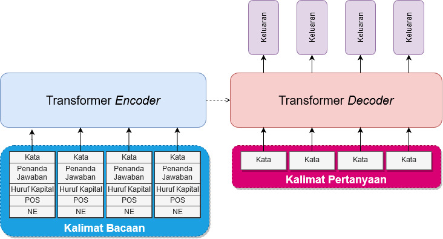
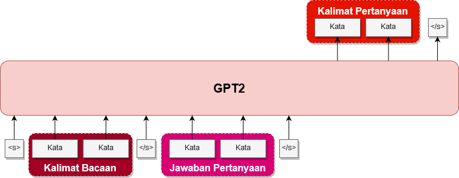

# Implementasi *Deep Learning* dengan *Sequence to Sequence* untuk Sistem Pembangkit Pertanyaan Otomatis

Oleh: Ferdiant Joshua Muis - 13516047

## Ikhtisar

Membangun model pembangkit pertanyaan otomatis (_question generator_) menggunakan pendekatan _Deep Learning_ dengan _Sequence to sequence_.

## Latar Belakang

1. Pekerjaan pembuatan pertanyaan pada dunia pendidikan masih belum efektif dan terlalu menghabiskan waktu
bagi tenaga pengajar
2. Sistem *Automatic Question Generator* (AQG) untuk bahasa Indonesia belum pernah diciptakan
3. Pendekatan *deep learning* sudah terbukti lebih efektif dari pendekatan berbasis aturan

## Tujuan

1.	Membangun **model dan arsitektur** untuk **sistem AQG** dengan menggunakan **deep learning** untuk **bahasa Indonesia**
2.	Melakukan **eksperimen** pada pembangunan **sistem AQG** untuk **bahasa Indonesia** dengan pendekatan sequence to sequence dan
pengembangannya

## Metodologi dan Rancangan Model *Deep Learning*

1. Menerjemahkan dataset SQuADv2.0
2. Mempersiapkan dataset hasil translasi (posisi jawaban)
3. Mempersiapkan fitur linguistik (posisi jawaban, *case*, POS, NE)
4. Melatih model *deep learning* dengan berbagai pengembangannya
5. Mengevaluasi dengan metrik yang dipilih

## Arsitektur yang digunakan

Mengikuti *baseline* arsitektur AQG milik [Du dkk., (2017)](https://arxiv.org/abs/1705.00106) (BiLSTM). Kemudian
dikembangkan dan menggunakan:

1. BiLSTM
2. BiGRU
3. Transformer
4. _GPT2 (tidak dilakukan eksperimen secara mendalam)_

Beserta beberapa variasi berikut untuk masing-masing model:

1. Mekanisme *copy*
2. Mekanisme *coverage* (kecuali untuk Transformer)
3. Penggunaan dataset *cased* dan *uncased*

Arsitektur RNN (LSTM dan GRU):  

Arsitektur Transformer:  

Arsitektur GPT2:  

## Dataset dan  Evaluasi

**Dataset:** SQuAD v2.0

**Evaluasi menggunakan 5 metrik:**  
Hasil terbaik diperoleh model _BiGRU-Uncased-Copy-Coverage_
1. BLEU-1: **38,35** 
2. BLEU-2: **20,96**
3. BLEU-3: **10,68**
4. BLEU-4: **5,78**
5. ROUGE-L: **43,4**

## Hasil

|  Model                  | BLEU 1  | BLEU 2  | BLEU 3  | BLEU 4 | ROUGE-L | Epoch |
|-------------------------|---------|---------|---------|--------|---------|-------|
|  **BiGRU-3**            |         |         |         |        |         |       |
|  Cased                  |  32.14  |  14.92  |  6.66   |  3.37  |  37.06  |  20   |
|  Cased-Copy             |  35.16  |  18.53  |  9.59   |  5.31  |  40.34  |  20   |
|  Cased-Copy-Coverage    |  34.92  |  18.24  |  9.25   |  5.08  |  40.28  |  20   |
|  Uncased                |  35.06  |  17.02  |  7.36   |  3.55  |  39.69  |  20   |
|  Uncased-Copy           |  37.86  |  20.46  |  10.36  |  5.69  |  43.03  |  20   |
|  Uncased-Copy-Coverage  |**38.35**|**20.96**|**10.68**|**5.78**|**43.4** |  20   |
|  **BiLSTM-3**           |         |         |         |        |         |       |
|  Cased                  |  31.11  |  13.83  |  5.88   |  2.84  |  36.09  |  10   |
|  Cased-Copy             |  34.6   |  18.04  |  9.17   |  5.16  |  39.78  |  10   |
|  Cased-Copy-Coverage    |  34.79  |  18.21  |  9.31   |  5.18  |  39.92  |  10   |
|  Uncased                |  34.74  |  16.42  |  6.92   |  3.3   |  39.24  |  10   |
|  Uncased-Copy           |  38.07  |  20.56  |  10.53  |  5.76  |**42.95**|  10   |
|  Uncased-Copy-Coverage  |**38.26**|**20.62**|**10.43**|**5.78**|  42.91  |  10   |
|  **Transformer-3**      |         |         |         |        |         |       |
|  Cased                  |  28.68  |  11.17  |  4.01   |  1.47  |  33.61  |  300  |
|  Cased-Copy             |  33.13  |  17.07  |  8.45   |  4.49  |  38.76  |  300  |
|  Uncased                |  31.57  |  13.38  |  4.74   |  1.83  |  36.22  |  300  |
|  Uncased-Copy           |**37.07**|**19.78**|**9.73** |**5.16**|**42.27**|  300  |

## Perbandingan Performa

| Penelitian Milik                                                  | BLEU Weighted | BLEU-1    | BLEU-2    | BLEU-3    | BLEU-4    | ROUGE-L   |
|-------------------------------------------------------------------|---------------|-----------|-----------|-----------|-----------|-----------|
| [Serban dkk. (2016)](https://arxiv.org/abs/1603.06807)            | 33,32         | -         | -         | -         | -         | -         |
| [Du dkk. (2017)](https://arxiv.org/abs/1705.00106)                | -             | 43,09     | 25,96     | 17,50     | 12,28     | 39,75     |
| [Harrison dkk. (2019)](https://www.aclweb.org/anthology/W18-6536) | -             | -         | -         | -         | 19,98     | 48,23     |
| [Kumar dkk. (2019)](https://arxiv.org/abs/1808.04961)             | -             | **48,13** | **31,15** | 22,01     | 16,48     | 44,11     |
| [Liu dkk. (2018)](https://arxiv.org/abs/1902.10418)               | -             | 46,58     | 30,90     | **22,82** | 17,55     | 44,53     |
| [Dong dkk. (2019)](https://arxiv.org/abs/1905.03197)              | -             | -         | -         | -         | **23,75** | **52,04** |
| BiGRU-3                                                           | -             | 38,35     | 20,96     | 10,68     | 5,78      | 43,4      |

## Hasil Inferensi

| Keterangan            | Kalimat                                                                                                                                                                                                                                                                    |
|-----------------------|----------------------------------------------------------------------------------------------------------------------------------------------------------------------------------------------------------------------------------------------------------------------------|
| **1**                 |                                                                                                                                                                                                                                                                            |
| **Kalimat**           | Kadipaten Normandia , yang mereka bentuk dengan perjanjian dengan mahkota Prancis , adalah tanah yang indah bagi Prancis abad pertengahan , dan di bawah Richard I dari Normandia ditempa menjadi sebuah pemerintahan yang kohesif dan tangguh dalam masa jabatan feodal . |
| **Jawaban**           | Richard I                                                                                                                                                                                                                                                                  |
| **Target**            | Siapa yang memerintah kadipaten Normandia                                                                                                                                                                                                                                  |
| **BiGRU-3**           |                                                                                                                                                                                                                                                                            |
| Cased                 | Siapa yang mendirikan Kadipaten Normandia ?                                                                                                                                                                                                                                |
| Cased-Copy            | Siapa yang memerintah Kadipaten Normandia ?                                                                                                                                                                                                                                |
| Cased-Copy-Coverage   | Siapa yang membangun Kadipaten Normandia ?                                                                                                                                                                                                                                 |
| Uncased               | kekaisaran mana yang menjadi penguasa kekaisaran ?                                                                                                                                                                                                                         |
| Uncased-Copy          | siapa yang memimpin kadipaten normandia ?                                                                                                                                                                                                                                  |
| Uncased-Copy-Coverage | siapa yang memerintah pemerintahan normandia ?                                                                                                                                                                                                                             |
| **BiLSTM-3**          |                                                                                                                                                                                                                                                                            |
| Cased                 | Siapa yang menguasai Kerajaan Normandia ?                                                                                                                                                                                                                                  |
| Cased-Copy            | Siapa yang menguasai Kadipaten Normandia ?                                                                                                                                                                                                                                 |
| Cased-Copy-Coverage   | Siapa yang memimpin Kadipaten Normandia ?                                                                                                                                                                                                                                  |
| Uncased               | siapa yang menguasai kadipaten normandia ?                                                                                                                                                                                                                                 |
| Uncased-Copy          | siapa yang memerintah normandia ?                                                                                                                                                                                                                                          |
| Uncased-Copy-Coverage | siapa yang mendirikan kadipaten normandia ?                                                                                                                                                                                                                                |
| **Transformer-3**     |                                                                                                                                                                                                                                                                            |
| Cased                 | Penguasa Prancis manakah yang memerintah Alsace ?                                                                                                                                                                                                                          |
| Cased-Copy            | Siapa yang memerintah Kadipaten Normandia ?                                                                                                                                                                                                                                |
| Uncased               | siapa yang menjadi penguasa hongaria ?                                                                                                                                                                                                                                     |
| Uncased-Copy          | siapa yang memerintah normandia ?                                                                                                                                                                                                                                          |
| **2**                 |                                                                                                                                                                                                                                                                            |
| **Kalimat**           | Gaya konservatif yang bekerja pada sistem tertutup memiliki kerja mekanis terkait yang memungkinkan energi untuk mengkonversi hanya antara bentuk kinetik atau potensial .                                                                                                 |
| **Jawaban**           | kinetik                                                                                                                                                                                                                                                                    |
| **Target**            | Apa bentuk energi potensial yang dapat berubah ?                                                                                                                                                                                                                           |
| **BiGRU-3**           |                                                                                                                                                                                                                                                                            |
| Cased                 | Apa yang memungkinkan energi untuk mengubah energi ?                                                                                                                                                                                                                       |
| Cased-Copy            | Apa yang dimaksud dengan potensial ?                                                                                                                                                                                                                                       |
| Cased-Copy-Coverage   | Jenis energi apa yang tidak dimiliki gaya konservatif ?                                                                                                                                                                                                                    |
| Uncased               | apa bentuk yang memungkinkan energi untuk mengubah energi ?                                                                                                                                                                                                                |
| Uncased-Copy          | apa yang memiliki kerja mekanis ?                                                                                                                                                                                                                                          |
| Uncased-Copy-Coverage | apa yang memiliki kerja mekanis untuk mengkonversi energi ?                                                                                                                                                                                                                |
| **BiLSTM-3**          |                                                                                                                                                                                                                                                                            |
| Cased                 | Apa jenis bentuk yang tidak pernah digunakan oleh gaya Konservatif ?                                                                                                                                                                                                       |
| Cased-Copy            | Apa yang digunakan energi untuk mengkonversi energi ?                                                                                                                                                                                                                      |
| Cased-Copy-Coverage   | Apa yang memungkinkan energi untuk mengkonversi energi ?                                                                                                                                                                                                                   |
| Uncased               | gaya konservatif apa yang digunakan oleh gaya konservatif ?                                                                                                                                                                                                                |
| Uncased-Copy          | gaya konservatif yang bekerja pada sistem tertutup memiliki bentuk apa ?                                                                                                                                                                                                   |
| Uncased-Copy-Coverage | gaya konservatif yang memiliki energi mekanis terkait terkait bentuk apa ?                                                                                                                                                                                                 |
| **Transformer-3**     |                                                                                                                                                                                                                                                                            |
| Cased                 | Apa bentuk energi yang dapat dikonversi oleh arsitektur ?                                                                                                                                                                                                                  |
| Cased-Copy            | Apa yang memungkinkan energi untuk mengkonversi hanya antara bentuk potensial ?                                                                                                                                                                                            |
| Uncased               | jenis energi apa yang digunakan sistem kerja ?                                                                                                                                                                                                                             |
| Uncased-Copy          | gaya konservatif yang bekerja pada sistem tertutup antara bentuk apa ?                                                                                                                                                                                                     |
| **3**                 |                                                                                                                                                                                                                                                                            |
| **Kalimat**           | Celoron terus ke selatan sampai ekspedisinya mencapai pertemuan di Ohio dan sungai Miami , yang terletak tepat di sebelah selatan desa Pickawillany , rumah kepala suku Miami yang dikenal sebagai " Orang Inggris Tua " .                                                 |
| **Jawaban**           | Desa Pickawillany                                                                                                                                                                                                                                                          |
| **Target**            | Di mana Old Briton tidak menelepon ke rumah ?                                                                                                                                                                                                                              |
| **BiGRU-3**           |                                                                                                                                                                                                                                                                            |
| Cased                 | Di mana di Miami dan Sungai Miami berada ?                                                                                                                                                                                                                                 |
| Cased-Copy            | Di mana sungai Miami berada ?                                                                                                                                                                                                                                              |
| Cased-Copy-Coverage   | Di mana rumah kepala suku Miami ?                                                                                                                                                                                                                                          |
| Uncased               | di mana miami berada ?                                                                                                                                                                                                                                                     |
| Uncased-Copy          | desa apa yang dikenal sebagai " orang inggris tua " ?                                                                                                                                                                                                                      |
| Uncased-Copy-Coverage | di mana sungai miami berada ?                                                                                                                                                                                                                                              |
| **BiLSTM-3**          |                                                                                                                                                                                                                                                                            |
| Cased                 | Apa nama desa di Ohio ?                                                                                                                                                                                                                                                    |
| Cased-Copy            | Apa yang terletak di sebelah Miami ?                                                                                                                                                                                                                                       |
| Cased-Copy-Coverage   | Apa yang terletak di sebelah selatan Miami ?                                                                                                                                                                                                                               |
| Uncased               | di desa apa miami berada ?                                                                                                                                                                                                                                                 |
| Uncased-Copy          | di mana rumah kepala suku miami ?                                                                                                                                                                                                                                          |
| Uncased-Copy-Coverage | di mana rumah kepala suku miami ?                                                                                                                                                                                                                                          |
| **Transformer-3**     |                                                                                                                                                                                                                                                                            |
| Cased                 | Apa nama desa yang terletak di sebelah timur Miami ?                                                                                                                                                                                                                       |
| Cased-Copy            | Apa nama rumah kepala suku Miami ?                                                                                                                                                                                                                                         |
| Uncased               | di mana miami berada ?                                                                                                                                                                                                                                                     |
| Uncased-Copy          | di mana celoron berada ?                                                                                                                                                                                                                                                   |
