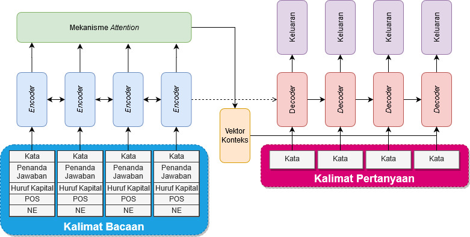
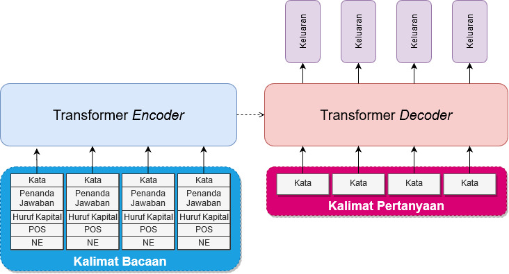
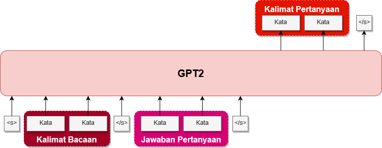

# Implementasi *Deep Learning* dengan *Sequence to Sequence* untuk Sistem Pembangkit Pertanyaan Otomatis

Oleh: Ferdiant Joshua Muis - 13516047

## Ikhtisar

Membangun model pembangkit pertanyaan otomatis (_question generator_) berbahasa Indonesia menggunakan salah satu 
pendekatan _deep learning_, yaitu _sequence to sequence_.

## Latar Belakang

1. Pekerjaan pembuatan pertanyaan pada dunia pendidikan masih belum efektif dan terlalu menghabiskan waktu
bagi tenaga pengajar
2. Sistem *Automatic Question Generator* (AQG) berbahasa Indonesia belum pernah diciptakan
3. Pendekatan *deep learning* sudah terbukti lebih efektif dari pendekatan berbasis aturan

## Tujuan

Membangun sistem AQG untuk bahasa Indonesia dengan menggunakan pendekatan **sequence to sequence**.

## Pustaka

PyTorch dan OpenNMT

## Metodologi dan Rancangan Model *Deep Learning*

1. Menerjemahkan dataset SQuADv2.0
2. Mempersiapkan dataset hasil translasi (posisi jawaban)
3. Mempersiapkan fitur linguistik (posisi jawaban, *case*, POS, NE)
4. Melatih model *deep learning* dengan berbagai pengembangannya
5. Mengevaluasi dengan metrik yang dipilih

## Arsitektur yang digunakan

Mengikuti *baseline* arsitektur AQG milik [Du dkk., (2017)](https://arxiv.org/abs/1705.00106) (BiLSTM). Kemudian
dikembangkan dan menggunakan:

1. BiLSTM
2. BiGRU
3. Transformer
4. _GPT2 (tidak dilakukan eksperimen secara mendalam)_

Beserta beberapa variasi berikut untuk masing-masing model:

1. Mekanisme *copy*
2. Mekanisme *coverage* (kecuali untuk Transformer)
3. Penggunaan dataset *cased* dan *uncased*

## Dataset

1. SQuAD v2.0
    1. Train: 102,657
    2. Validation: 11,407
    3. Test: 10,567
2. TyDiQA (bagian bahasa Indonesia)
    1. Test: 550
    
Arsitektur RNN (LSTM dan GRU):  

Arsitektur Transformer:  

Arsitektur GPT2:  

## Evaluasi

**Evaluasi menggunakan 5 metrik:**  
Hasil terbaik diperoleh model _BiGRU-Uncased-Copy-Coverage_

1. Pada _dataset_ SQuAD v2.0
    1. BLEU-1: **39,2** 
    2. BLEU-2: **21,48**
    3. BLEU-3: **10,88**
    4. BLEU-4: **5,86**
    5. ROUGE-L: **43,32**
1. Pada _dataset_ TyDiQA
    1. BLEU-1: **40,01** 
    2. BLEU-2: **20,68**
    3. BLEU-3: **10,28**
    4. BLEU-4: **6,44**
    5. ROUGE-L: **44,17**

## Hasil

* Pada _dataset_ SQuAD v2.0

| Model pada SQuAD v2.0 | BLEU-1  | BLEU-2  | BLEU-3  | BLEU-4  | ROUGE-L | Epoch |
|-----------------------|---------|---------|---------|---------|---------|-------|
|**BiGRU-3**            |         |         |         |         |         |       |
| Cased                 |  32,59  |  15,09  |  6,73   |  3,35   |  36,82  |  20   |
| Cased-Copy            |  35,75  |  18,74  |  9,61   |  5,3    |  40,28  |  20   |
| Cased-Copy-Coverage   |  35,63  |  18,67  |  9,51   |  5,22   |  40,25  |  20   |
| Uncased               |  35,42  |  17,1   |  7,37   |  3,55   |  39,32  |  20   |
| Uncased-Copy          |  38,66  |  21,03  |  10,68  |**5,87** |  43,02  |  20   |
| Uncased-Copy-Coverage |**39,2** |**21,48**|**10,88**|  5,86   |**43,32**|  20   |
|**BiLSTM-3**           |         |         |         |         |         |       |
| Cased                 |  31,75  |  14,17  |  6,03   |  2,84   |  36,08  |  10   |
| Cased-Copy            |  35,44  |  18,43  |  9,33   |  5,11   |  40,02  |  10   |
| Cased-Copy-Coverage   |  35,48  |  18,47  |  9,29   |  5,08   |  40,06  |  10   |
| Uncased               |  35,08  |  16,56  |  6,91   |  3,22   |  38,97  |  10   |
| Uncased-Copy          |  38,92  |  21,09  |  10,69  |  5,75   |**43,1** |  10   |
| Uncased-Copy-Coverage |**39,14**|**21,27**|**10,72**|**5,93** |  43,08  |  10   |
|**Transformer-3**      |         |         |         |         |         |       |
| Cased                 |  29,33  |  11,33  |  3,96   |  1,35   |  33,38  |  300  |
| Cased-Copy            |  34,4   |  17,81  |  8,92   |  4,64   |  39,05  |  300  |
| Uncased               |  32,03  |  13,59  |  4,7    |  1,72   |  35,91  |  300  |
| Uncased-Copy          |**38,14**|**20,57**|**10,16**|**5,38** |**42,37**|  300  |

* Pada _dataset_ TyDiQA

| Model pada TyDiQA     | BLEU-1  | BLEU-2  | BLEU-3  | BLEU-4  | ROUGE-L | Epoch |
|-----------------------|---------|---------|---------|---------|---------|-------|
|**BiGRU-3**            |         |         |         |         |         |       |
| Cased                 |  31,41  |  12,2   |  4,18   |  1,96   |  35,34  |  20   |
| Cased-Copy            |  35,35  |  16,15  |  8,08   |  4,51   |  39,35  |  20   |
| Cased-Copy-Coverage   |  35,53  |  15,69  |  7,7    |  4,53   |  39,46  |  20   |
| Uncased               |  33,89  |  14,0   |  5,38   |  2,88   |  37,98  |  20   |
| Uncased-Copy          |  39,12  |  19,87  |**10,36**|  6,24   |  43,39  |  20   |
| Uncased-Copy-Coverage |**40,01**|**20,68**|  10,28  |**6,44** |**44,17**|  20   |
|**BiLSTM-3**           |         |         |         |         |         |       |
| Cased                 |  31,0   |  11,95  |  3,89   |  1,37   |  35,12  |  10   |
| Cased-Copy            |  35,0   |  15,13  |  7,04   |  4,16   |  38,97  |  10   |
| Cased-Copy-Coverage   |  35,06  |  15,68  |  7,72   |  4,6    |  39,12  |  10   |
| Uncased               |  33,21  |  13,66  |  5,04   |  2,53   |  37,39  |  10   |
| Uncased-Copy          |  39,39  |**19,71**|  10,11  |**6,37** |  43,67  |  10   |
| Uncased-Copy-Coverage |**39,7** |  19,63  |**10,14**|  6,23   |**43,86**|  10   |
|**Transformer-3**      |         |         |         |         |         |       |
| Cased                 |  27,51  |  8,24   |  0,95   |  0,31   |  31,49  |  300  |
| Cased-Copy            |  33,8   |  13,9   |  5,7    |  3,16   |  38,06  |  300  |
| Uncased               |  30,68  |  10,82  |  2,88   |  1,0    |  34,77  |  300  |
| Uncased-Copy          |**38,69**|**19,42**|**9,0**  |**5,04** |**43,36**|  300  |

## Perbandingan Performa

| Penelitian Milik                                                  | BLEU Weighted | BLEU-1    | BLEU-2    | BLEU-3    | BLEU-4    | ROUGE-L   |
|-------------------------------------------------------------------|---------------|-----------|-----------|-----------|-----------|-----------|
| [Serban dkk. (2016)](https://arxiv.org/abs/1603.06807)            | 33,32         | -         | -         | -         | -         | -         |
| [Du dkk. (2017)](https://arxiv.org/abs/1705.00106)                | -             | 43,09     | 25,96     | 17,50     | 12,28     | 39,75     |
| [Harrison dkk. (2019)](https://www.aclweb.org/anthology/W18-6536) | -             | -         | -         | -         | 19,98     | 48,23     |
| [Kumar dkk. (2019)](https://arxiv.org/abs/1808.04961)             | -             | **48,13** | **31,15** | 22,01     | 16,48     | 44,11     |
| [Liu dkk. (2018)](https://arxiv.org/abs/1902.10418)               | -             | 46,58     | 30,90     | **22,82** | 17,55     | 44,53     |
| [Dong dkk. (2019)](https://arxiv.org/abs/1905.03197)              | -             | -         | -         | -         | **23,75** | **52,04** |
| BiGRU-3                                                           | -             | 39,2      | 21,48     | 10,88     | 5,86      | 43,32      |

## Hasil Inferensi

* Pada _dataset_ SQuAD v2.0

| Keterangan            | Kalimat                                                                                                                                                                                                                                                                    |
|-----------------------|----------------------------------------------------------------------------------------------------------------------------------------------------------------------------------------------------------------------------------------------------------------------------|
| 1                     |                                                                                                                                                                                                                                                                            |
| Kalimat               | Kadipaten Normandia , yang mereka bentuk dengan perjanjian dengan mahkota Prancis , adalah tanah yang indah bagi Prancis abad pertengahan , dan di bawah Richard I dari Normandia ditempa menjadi sebuah pemerintahan yang kohesif dan tangguh dalam masa jabatan feodal . |
| Jawaban               | Richard I                                                                                                                                                                                                                                                                  |
| Target                | Siapa yang memerintah kadipaten Normandia                                                                                                                                                                                                                                  |
| BiGRU-3               |                                                                                                                                                                                                                                                                            |
| Cased                 | Siapa yang menjadi penguasa dari Kerajaan Normandia ?                                                                                                                                                                                                                      |
| Cased-Copy            | Siapa yang memerintah Kadipaten Normandia ?                                                                                                                                                                                                                                |
| Cased-Copy-Coverage   | Siapa yang ditempa menjadi sebuah pemerintahan yang kohesif ?                                                                                                                                                                                                              |
| Uncased               | apa penguasa yang memiliki pemerintahan yang kuat ?                                                                                                                                                                                                                        |
| Uncased-Copy          | di bawah siapa kadipaten normandia adalah sebuah pemerintahan ?                                                                                                                                                                                                            |
| Uncased-Copy-Coverage | siapa yang memerintah pemerintahan normandia ?                                                                                                                                                                                                                             |
| BiLSTM-3              |                                                                                                                                                                                                                                                                            |
| Cased                 | Siapa yang menguasai Kerajaan Normandia ?                                                                                                                                                                                                                                  |
| Cased-Copy            | Siapa yang menguasai Kadipaten Normandia ?                                                                                                                                                                                                                                 |
| Cased-Copy-Coverage   | Siapa yang memimpin Kadipaten Normandia ?                                                                                                                                                                                                                                  |
| Uncased               | siapa yang menguasai kadipaten normandia ?                                                                                                                                                                                                                                 |
| Uncased-Copy          | siapa yang memerintah normandia ?                                                                                                                                                                                                                                          |
| Uncased-Copy-Coverage | siapa yang mendirikan kadipaten normandia ?                                                                                                                                                                                                                                |
| Transformer-3         |                                                                                                                                                                                                                                                                            |
| Cased                 | Siapa yang menjadi pemimpin Prancis selama pertengahan abad pertengahan ?                                                                                                                                                                                                  |
| Cased-Copy            | Siapa yang memerintah Kadipaten Normandia ?                                                                                                                                                                                                                                |
| Uncased               | siapa yang menjadi penguasa hongaria selama abad pertengahan ?                                                                                                                                                                                                             |
| Uncased-Copy          | siapa yang memerintah normandia di normandia ?                                                                                                                                                                                                                             |
| 2                     |                                                                                                                                                                                                                                                                            |
| Kalimat               | Gaya konservatif yang bekerja pada sistem tertutup memiliki kerja mekanis terkait yang memungkinkan energi untuk mengkonversi hanya antara bentuk kinetik atau potensial .                                                                                                 |
| Jawaban               | kinetik                                                                                                                                                                                                                                                                    |
| Target                | Apa bentuk energi potensial yang dapat berubah ?                                                                                                                                                                                                                           |
| BiGRU-3               |                                                                                                                                                                                                                                                                            |
| Cased                 | Apa jenis bentuk yang tidak dapat digunakan untuk membuat antena ?                                                                                                                                                                                                         |
| Cased-Copy            | Apa yang dimaksud dengan energi mekanis ?                                                                                                                                                                                                                                  |
| Cased-Copy-Coverage   | Apa bentuk arsitektur yang tidak pernah digunakan pada sistem konservatif ?                                                                                                                                                                                                |
| Uncased               | apa bentuk yang memungkinkan energi untuk mengubah energi ?                                                                                                                                                                                                                |
| Uncased-Copy          | apa yang memiliki kerja untuk mengkonversi energi ?                                                                                                                                                                                                                        |
| Uncased-Copy-Coverage | apa yang memiliki kerja mekanis untuk mengkonversi energi ?                                                                                                                                                                                                                |
| BiLSTM-3              |                                                                                                                                                                                                                                                                            |
| Cased                 | Apa jenis bentuk yang tidak pernah digunakan oleh gaya Konservatif ?                                                                                                                                                                                                       |
| Cased-Copy            | Apa yang memungkinkan energi untuk mengkonversi energi ?                                                                                                                                                                                                                   |
| Cased-Copy-Coverage   | Apa yang memungkinkan energi untuk mengkonversi energi ?                                                                                                                                                                                                                   |
| Uncased               | gaya konservatif apa yang tidak memiliki energi mekanik ?                                                                                                                                                                                                                  |
| Uncased-Copy          | gaya konservatif bekerja untuk mengkonversi energi mekanis terkait dengan bentuk apa ?                                                                                                                                                                                     |
| Uncased-Copy-Coverage | gaya konservatif yang memungkinkan energi mekanis memungkinkan energi untuk mengkonversi bentuk apa ?                                                                                                                                                                      |
| Transformer-3         |                                                                                                                                                                                                                                                                            |
| Cased                 | Apa bentuk energi yang tidak dapat dikonversi oleh arsitektur ?                                                                                                                                                                                                            |
| Cased-Copy            | Apa jenis bentuk potensial yang digunakan oleh sistem tertutup ?                                                                                                                                                                                                           |
| Uncased               | apa bentuk energi yang digunakan sistem kerja yang sama ?                                                                                                                                                                                                                  |
| Uncased-Copy          | apa yang digunakan untuk mengkonversi energi untuk mengkonversi energi ke sistem tertutup ?                                                                                                                                                                                |
| 3                     |                                                                                                                                                                                                                                                                            |
| Kalimat               | Celoron terus ke selatan sampai ekspedisinya mencapai pertemuan di Ohio dan sungai Miami , yang terletak tepat di sebelah selatan desa Pickawillany , rumah kepala suku Miami yang dikenal sebagai " Orang Inggris Tua " .                                                 |
| Jawaban               | Desa Pickawillany                                                                                                                                                                                                                                                          |
| Target                | Di mana Old Briton tidak menelepon ke rumah ?                                                                                                                                                                                                                              |
| BiGRU-3               |                                                                                                                                                                                                                                                                            |
| Cased                 | Di mana di Miami dan Sungai Miami berada ?                                                                                                                                                                                                                                 |
| Cased-Copy            | Di mana sungai Miami berada ?                                                                                                                                                                                                                                              |
| Cased-Copy-Coverage   | Di mana Miami terletak ?                                                                                                                                                                                                                                                   |
| Uncased               | di mana miami berada ?                                                                                                                                                                                                                                                     |
| Uncased-Copy          | desa apa yang terletak di sebelah miami ?                                                                                                                                                                                                                                  |
| Uncased-Copy-Coverage | di desa apa sungai miami berada ?                                                                                                                                                                                                                                          |
| BiLSTM-3              |                                                                                                                                                                                                                                                                            |
| Cased                 | Apa nama desa di Ohio ?                                                                                                                                                                                                                                                    |
| Cased-Copy            | Di mana Miami berada di Miami ?                                                                                                                                                                                                                                            |
| Cased-Copy-Coverage   | Di mana orang Inggris tinggal ?                                                                                                                                                                                                                                            |
| Uncased               | apa yang utara dekat di sebelah selatan miami ?                                                                                                                                                                                                                            |
| Uncased-Copy          | apa yang terletak di sebelah selatan ohio ?                                                                                                                                                                                                                                |
| Uncased-Copy-Coverage | di mana " orang inggris tua " berada ?                                                                                                                                                                                                                                     |
| Transformer-3         |                                                                                                                                                                                                                                                                            |
| Cased                 | Apa nama desa yang terletak di sebelah timur Miami ?                                                                                                                                                                                                                       |
| Cased-Copy            | Apa yang terletak di sebelah selatan Miami ?                                                                                                                                                                                                                               |
| Uncased               | di mana miami berada ?                                                                                                                                                                                                                                                     |
| Uncased-Copy          | di mana celoron berada ?                                                                                                                                                                                                                                                   |
|                       |                                                                                                                                                                                                                                                                            |

* Pada _dataset_ TyDiQA

| Keterangan            | Kalimat                                                                                                                                                                                                                                                                             |
|-----------------------|-------------------------------------------------------------------------------------------------------------------------------------------------------------------------------------------------------------------------------------------------------------------------------------|
| 1                     |                                                                                                                                                                                                                                                                                     |
| Kalimat               | Penghulu Rasyid ( lahir di desa Telaga Itar tahun 1815 - meninggal di desa Banua Lawas , 15 Desember 1861 pada umur 46 tahun ) adalah salah seorang di antara sejumlah ulama Islam yang bangkit bergerak berjuang mengangkat senjata melawan penjajah Belanda dalam Perang Banjar . |
| Jawaban               | 15 Desember 1861                                                                                                                                                                                                                                                                    |
| Target                | Kapan Penghulu Rasyid meninggal ?                                                                                                                                                                                                                                                   |
| BiGRU-3               |                                                                                                                                                                                                                                                                                     |
| Cased                 | Kapan Penghulu Rasyid mati ?                                                                                                                                                                                                                                                        |
| Cased-Copy            | Kapan Penghulu Rasyid meninggal ?                                                                                                                                                                                                                                                   |
| Cased-Copy-Coverage   | Kapan Rasyid Rasyid mati ?                                                                                                                                                                                                                                                          |
| Uncased               | kapan perang banjar terjadi ?                                                                                                                                                                                                                                                       |
| Uncased-Copy          | kapan penghulu rasyid lahir ?                                                                                                                                                                                                                                                       |
| Uncased-Copy-Coverage | kapan penghulu rasyid meninggal ?                                                                                                                                                                                                                                                   |
| BiLSTM-3              |                                                                                                                                                                                                                                                                                     |
| Cased                 | Kapan Perang Rasyid mati ?                                                                                                                                                                                                                                                          |
| Cased-Copy            | Kapan Perang Banjar terjadi ?                                                                                                                                                                                                                                                       |
| Cased-Copy-Coverage   | Kapan Rasyid Rasyid mati ?                                                                                                                                                                                                                                                          |
| Uncased               | kapan desa rasyid meninggal ?                                                                                                                                                                                                                                                       |
| Uncased-Copy          | kapan penghulu rasyid lahir ?                                                                                                                                                                                                                                                       |
| Uncased-Copy-Coverage | rasyid rasyid lahir pada tanggal berapa ?                                                                                                                                                                                                                                           |
| Transformer-3         |                                                                                                                                                                                                                                                                                     |
| Cased                 | Kapan ulama mati ?                                                                                                                                                                                                                                                                  |
| Cased-Copy            | Kapan Rasyid Rasyid lahir ?                                                                                                                                                                                                                                                         |
| Uncased               | kapan penghulu mati ?                                                                                                                                                                                                                                                               |
| Uncased-Copy          | kapan penghulu rasyid rasyid meninggal ?                                                                                                                                                                                                                                            |
| 2                     |                                                                                                                                                                                                                                                                                     |
| Kalimat               | Genta / Mu Duo : terbuat dari logam , tetapi pemukulnya menggunakan kayu , oleh karena itu dinamakan Mu Duo / Bok Tok , Mu / Bok artinya kayu .                                                                                                                                     |
| Jawaban               | logam                                                                                                                                                                                                                                                                               |
| Target                | terbuat dari apakah Genta ?                                                                                                                                                                                                                                                         |
| BiGRU-3               |                                                                                                                                                                                                                                                                                     |
| Cased                 | Terbuat dari apa Genta / A ?                                                                                                                                                                                                                                                        |
| Cased-Copy            | Terbuat dari apa Genta / Duo ?                                                                                                                                                                                                                                                      |
| Cased-Copy-Coverage   | Terbuat dari apa Mu Duo ?                                                                                                                                                                                                                                                           |
| Uncased               | terbuat dari apa genta / kecapi ?                                                                                                                                                                                                                                                   |
| Uncased-Copy          | terbuat dari apakah mu duo ?                                                                                                                                                                                                                                                        |
| Uncased-Copy-Coverage | terbuat dari apa genta ?                                                                                                                                                                                                                                                            |
| BiLSTM-3              |                                                                                                                                                                                                                                                                                     |
| Cased                 | Terbuat dari apa Genta ?                                                                                                                                                                                                                                                            |
| Cased-Copy            | Terbuat dari apakah kayu itu ?                                                                                                                                                                                                                                                      |
| Cased-Copy-Coverage   | Terbuat dari apakah Mu Duo ?                                                                                                                                                                                                                                                        |
| Uncased               | terbuat dari apakah genta ?                                                                                                                                                                                                                                                         |
| Uncased-Copy          | dari bahan apa genta / mu terbuat ?                                                                                                                                                                                                                                                 |
| Uncased-Copy-Coverage | dari mana asal mu ?                                                                                                                                                                                                                                                                 |
| Transformer-3         |                                                                                                                                                                                                                                                                                     |
| Cased                 | Terbuat dari logam apa ?                                                                                                                                                                                                                                                            |
| Cased-Copy            | Terbuat dari apa kayu itu ?                                                                                                                                                                                                                                                         |
| Uncased               | terbuat dari apakah kayu itu ?                                                                                                                                                                                                                                                      |
| Uncased-Copy          | terbuat dari apakah genta ?                                                                                                                                                                                                                                                         |
| 3                     |                                                                                                                                                                                                                                                                                     |
| Kalimat               | Kaktus adalah nama yang diberikan untuk anggota tumbuhan berbunga famili Cactaceae .                                                                                                                                                                                                |
| Jawaban               | Cactaceae                                                                                                                                                                                                                                                                           |
| Target                | Apa nama ilmiah tumbuhan kaktus ?                                                                                                                                                                                                                                                   |
| BiGRU-3               |                                                                                                                                                                                                                                                                                     |
| Cased                 | Apa yang dimaksud dengan nama ?                                                                                                                                                                                                                                                     |
| Cased-Copy            | Dari mana asal Kaktus ?                                                                                                                                                                                                                                                             |
| Cased-Copy-Coverage   | Jenis famili apa yang digunakan untuk anggota tumbuhan ?                                                                                                                                                                                                                            |
| Uncased               | apa nama lain untuk pohon ?                                                                                                                                                                                                                                                         |
| Uncased-Copy          | apa anggota tumbuhan berbunga ?                                                                                                                                                                                                                                                     |
| Uncased-Copy-Coverage | apa nama tumbuhan untuk kaktus ?                                                                                                                                                                                                                                                    |
| BiLSTM-3              |                                                                                                                                                                                                                                                                                     |
| Cased                 | Untuk apa Kaktus digunakan ?                                                                                                                                                                                                                                                        |
| Cased-Copy            | Apa nama lain untuk anggota tumbuhan ?                                                                                                                                                                                                                                              |
| Cased-Copy-Coverage   | Dari mana asal nama yang diberikan ?                                                                                                                                                                                                                                                |
| Uncased               | untuk apa pohon itu digunakan ?                                                                                                                                                                                                                                                     |
| Uncased-Copy          | famili adalah nama tumbuhan untuk anggota tumbuhan apa ?                                                                                                                                                                                                                            |
| Uncased-Copy-Coverage | apa nama anggota tumbuhan kaktus ?                                                                                                                                                                                                                                                  |
| Transformer-3         |                                                                                                                                                                                                                                                                                     |
| Cased                 | Apa nama untuk tanaman benih ?                                                                                                                                                                                                                                                      |
| Cased-Copy            | Apa nama lain untuk anggota tumbuhan berbunga ?                                                                                                                                                                                                                                     |
| Uncased               | apa nama yang diberikan kepada spesies tanaman berbunga ?                                                                                                                                                                                                                           |
| Uncased-Copy          | famili adalah nama untuk anggota tumbuhan apa ?                                                                                                                                                                                                                                     |
